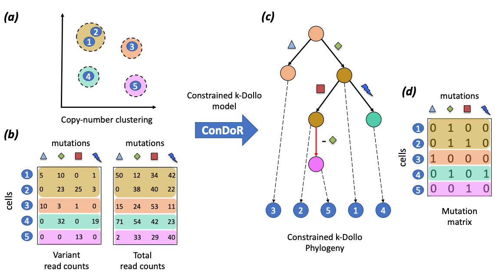

# ConDoR (constrained Dollo Reconstruction)


Overview of the ConDoR algorithm.
ConDoR takes as input: (a) A clustering of cells based on copy-number profiles and (b) variant and total read counts from scDNA-seq data.
ConDoR employs the Constrained k-Dollo model to construct the (c) constrained k-Dollo phylogeny and the (d) mutation matrix.


## Contents

  1. [Pre-requisites](#pre-requisites)
  2. [Usage instcructions](#usage)
     * [I/O formats](#io)
     * [ConDoR](#condor)

<a name="pre-requisites"></a>
## Pre-requisites
+ python3 (>=3.6)
+ [numpy](https://numpy.org/doc/)
+ [pandas](https://pandas.pydata.org/pandas-docs/stable/index.html)
+ [gurobipy](https://www.gurobi.com/documentation/9.0/quickstart_mac/py_python_interface.html)
+ [networkx](https://networkx.org/)
+ (optional for generating simulation instances) [snakemake (>=5.2.0)](https://snakemake.readthedocs.io)

<a name="usage"></a>
## Usage instructions

<a name="io"></a>
### I/O formats
The input for ConDoR are CSV files containing the total read counts, the variant read counts and the clustering (with or without the mutation matrix).
It is important that the format matches the examples given in `data/sample` that were generated using the following commands.

```bash
mkdir data/sample
python src/simulation_reads.py -n 25 -m 25 -p 5 -k 1 -s 0 -d 0.1 -a 0.001 -b 0.001 -o data/sample/overview
```

<a name="condor"></a>
### ConDoR

    usage: condor.py [-h] [-i I] [-r R] [-v V] [-s S] [-a A] [-b B] [--ado ADO] [-k K] -o O [-t T]

    optional arguments:
      -h, --help  show this help message and exit
      -i I        csv file with mutation matrix and cluster id
      -r R        csv file with total read count matrix
      -v V        csv file with variant read count matrix
      -s S        file containing list of SNPs
      -a A        false positive error rate [0.001]
      -b B        false negative error rate [0.001]
      --ado ADO   precision parameter for ADO
      -k K        maximum number of losses for an SNV
      -o O        output prefix
      -t T        time limit in seconds [1800]

An example of usage is as follows.

    $ python src/condor.py -i  data/sample/overview_character_matrix.csv -a 0.0018 -b 0.001 -k 1 -r data/sample/overview_read_count.csv -v data/sample/overview_variant_count.csv -o data/sample/overview 
